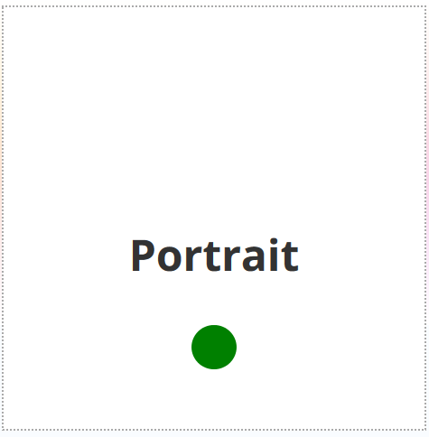
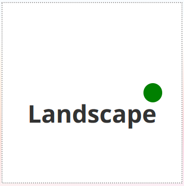

# CSS Animation - Landscape Vs Portrait

In this project, we will learn how to use media query orientation property to animate round object when orientaion changes.

[View demo site here.](http://edwinchen.co/css_animation_landscape_vs_portrait/)

